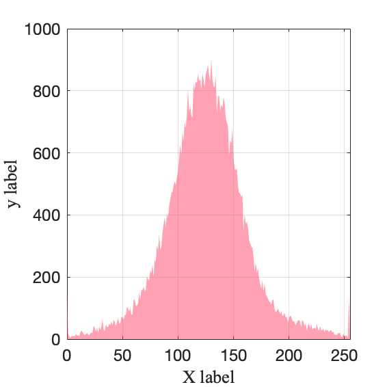

# Drawing_specification
A drawing specification for use by laboratory personnel.

## software
The software used was matlab, version 2023a.

## How to use the drawline.m and histogram.m
Modify the file path read and then run the xxx.m file using matlab. We put some .txt files in ./example to work with.

## Example files for code generation

    
    
draw_line.m

    
    
histogram.m

